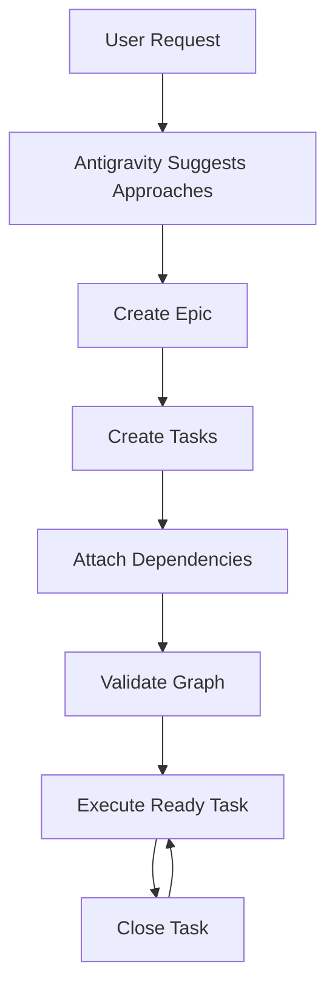

# Agent Instructions

This project uses **bd** (beads) for issue tracking. Run `bd onboard` to get started.

## 🚀 Quick Reference

```bash
bd ready              # Find available work
bd show <id>          # View issue details
bd update <id> --status in_progress  # Claim work
bd close <id>         # Complete work
bd sync               # Sync with git
```

---

## 🛬 Landing the Plane (Session Completion)

**When ending a work session**, you MUST complete ALL steps below. Work is NOT complete until `git push` succeeds.

### 📋 Mandatory Workflow

1. **File issues for remaining work** - Create issues for anything that needs follow-up.
2. **Run quality gates** - Tests, linters, builds (if code changed).
3. **Update issue status** - Close finished work, update in-progress items.
4. **PUSH TO REMOTE** - This is **MANDATORY**:
   ```bash
   git pull --rebase
   bd sync
   git push
   git status  # MUST show "up to date with origin"
   ```
5. **Clean up** - Clear stashes, prune remote branches.
6. **Verify** - All changes committed AND pushed.
7. **Hand off** - Provide context for next session.

> [!IMPORTANT]
> **CRITICAL RULES:**
> - Work is NOT complete until `git push` succeeds.
> - NEVER stop before pushing - that leaves work stranded locally.
> - NEVER say "ready to push when you are" - **YOU** must push.
> - If push fails, resolve and retry until it succeeds.

---

## 🤖 Antigravity Global Rule — Beads Workflow

Beads ek lightweight issue tracker hai jisme issues dependency graph ke through chain hote hain — bilkul beads ki mala ki tarah. Iska main purpose hai project planning, execution tracking aur long‑term engineering memory maintain karna.

Antigravity ko hamesha Beads ko **single source of truth** treat karna hoga.

1. Koi bhi plan chat memory ya markdown TODO me store nahi hoga.
2. Har kaam ek Beads issue hoga.
3. Har issue dependency graph ka part hoga.

### 🎭 Antigravity's Role
1. User ko possible approaches batana.
2. Best recommended approach suggest karna.
3. Plan ko Beads epic + tasks me convert karna.
4. Dependency graph maintain karna.
5. User ko correct commands guide karna.

---

## ✍️ Task Description Rule (MANDATORY)

Har Beads task ki description **Romanised Hindi me ek line me likhi jayegi**.

**Format:** `KYA | KYON | SANDARBH`

> [!TIP]
> **Example:** `Authentication middleware implement karna | duplicate auth validation remove karne aur security consistency lane ke liye | express request pipeline me middleware layer ke roop me integrate hoga`

**Rules:**
- Ek hi line.
- Roman Hindi.
- WHAT / WHY / CONTEXT combine hone chahiye.

---

## ⚡ Basic Execution Workflow

Typical Antigravity execution cycle:

1. **Plan:** Generate approach and share with user.
2. **Epic:** Create epic (e.g., `bd create "Auth System" -t epic`).
3. **Tasks:** Create tasks with Romanised Hindi descriptions.
4. **Dependencies:** Attach tasks to epic (e.g., `bd dep add --type parent-child BD-101 BD-102`).
5. **Execute:** Run ready tasks (e.g., `bd ready`, `bd set-state status=in_progress <id>`).

---

## 📊 Visual Workflow



---

## 🛠️ Beads CLI Usage Guide

| Category | Commands |
| :--- | :--- |
| **Daily Work** | `ready`, `show`, `update`, `close`, `sync` |
| **Creation** | `create`, `create-form`, `q` (quick capture) |
| **Relationships** | `dep`, `epic`, `swarm`, `parent-child` |
| **Navigation** | `list`, `search`, `query`, `children`, `blocked` |
| **Maintenance** | `doctor`, `migrate`, `rename`, `delete` |
| **Advanced** | `gate`, `merge-slot`, `vc` (version control), `dolt` |

### 🔍 Discovery & Status
- `bd ready`: Show tasks with no active blockers.
- `bd list`: List issues with optional filters.
- `bd search <query>`: Full-text search across issues.
- `bd graph`: Visualize the dependency tree.

### 🔄 Data & Sync
- `bd sync`: Export database to JSONL and prepare for git.
- `bd export`: Export issues to different formats (JSONL, Obsidian).

---

## 💡 Advisory Behavior

Antigravity ko sirf commands run nahi karni balki user ko guide bhi karna hai.

**Scenario:** User says "authentication system add karna hai"

**Antigravity should:**
1. Architecture options explain kare.
2. Best approach recommend kare.
3. Epic create kare.
4. Tasks generate kare.
5. Dependency graph build kare.
6. Execution guide kare using `bd ready`.
