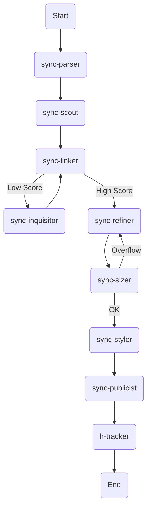

# Sync Module Agent State Machine

## Overview

The Sync Module Agent State Machine defines the lifecycle of a single job application, from the initial Job Description (JD) ingestion to final tracking and metrics.

## State Transitions

### 1. Ingestion Phase (`STAGE_INGEST`)

- **Active Agent**: `sync-parser`
- **Trigger**: User inputs raw JD or Recruiter profile.
- **Goal**: Create structured `jd_profile`.
- **Success**: `sync-parser` closed → Unblocks `STAGE_SCOUT`.

### 2. Research Phase (`STAGE_SCOUT`)

- **Active Agent**: `sync-scout`
- **Trigger**: `jd_profile` created.
- **Goal**: Gather brand/culture context.
- **Success**: `sync-scout` closed → Unblocks `STAGE_LINK`.

### 3. Mapping Phase (`STAGE_LINK`)

- **Active Agent**: `sync-linker`
- **Trigger**: Brand context and `jd_profile` ready.
- **Goal**: Align career signals with requirements; generate alignment scores.
- **Success**: `alignment_scores` stored.
  - If scores > 0.8: Unblocks `STAGE_REFINE`.
  - If scores < 0.6: Blocks `STAGE_REFINE` → Unblocks `STAGE_INQUIRE`.

### 4. Inquiry Phase (`STAGE_INQUIRE`) [Optional]

- **Active Agent**: `sync-inquisitor`
- **Trigger**: Low alignment score identified.
- **Goal**: Extract missing signal via user interview.
- **Success**: New signals indexed → Re-run `STAGE_LINK`.

### 5. Refining Phase (`STAGE_REFINE`)

- **Active Agent**: `sync-refiner`
- **Trigger**: High alignment score confirmed.
- **Goal**: Sculpt bullets and summary.
- **Success**: Draft resume ready → Unblocks `STAGE_SIZE`.

### 6. Validation Phase (`STAGE_SIZE`)

- **Active Agent**: `sync-sizer`
- **Trigger**: Draft resume generated.
- **Goal**: Layout and one-page budget check.
- **Failure**: Loop back to `STAGE_REFINE` with trim instructions.
- **Success**: Layout valid → Unblocks `STAGE_STYLE`.

### 7. Styling Phase (`STAGE_STYLE`)

- **Active Agent**: `sync-styler`
- **Trigger**: Layout validated.
- **Goal**: Apply Design System v1.1 tokens and company colors.
- **Success**: Final `ResumeVersion` stored → Unblocks `STAGE_DRAFT`.

### 8. Drafting Phase (`STAGE_DRAFTS`)

- **Active Agent**: `sync-publicist`
- **Trigger**: `ResumeVersion` finalized.
- **Goal**: Create outreach copy (Cover Letter/LinkedIn).
- **Success**: Outreach drafts ready → Unblocks `STAGE_TRACK`.

### 9. Tracking Phase (`STAGE_TRACK`)

- **Active Agent**: `lr-tracker`
- **Trigger**: Application submitted by user.
- **Goal**: Log `ApplicationRecord` and monitor success ledger.
- **Success**: Outcome recorded for long-term metric optimization.

## State Map (Mermaid)

## Governance

- **State Persistence**: All transitions MUST be recorded in the `success_ledger`.
- **Interruption Recovery**: In the event of a system crash, `lr-tracker` uses Beads to identify the last active stage and resume state.
- **Concurrency**: Only one "Writing" agent (Refiner, Sizer, Styler) may hold the lock on a `ResumeVersion` at any time.
