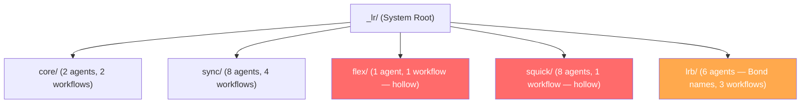

# Complete Beads Breakdown: Linkright vs BMAD Audit Plan

This document outlines the full hierarchical structure in Beads for the Linkright vs BMAD structural and capability audit. All tasks are linked sequentially (blocking the next), and subtasks are linked to their respective parent tasks.

---

## 🏗 Epic: Linkright vs BMAD Structural Quality Audit (`sync-it7`)

### 1️⃣ Task 1: Layer 1: Root-level architecture comparison (`sync-7dr`)

- **Subtask 1.1**: Root files comparison (AGENTS.md, README)
- **Subtask 1.2**: Top-level directory structure analysis

### 2️⃣ Task 2: Layer 2: Config and manifest system comparison (`sync-dk4`)

- **Subtask 2.1**: Manifest files comparison (agent, workflow, etc)
- **Subtask 2.2**: IDE config structures comparison
- **Subtask 2.3**: Agent customize YAML presence analysis

### 3️⃣ Task 3: Layer 3: Memory and sidecar system comparison (`sync-2zu`)

- **Subtask 3.1**: BMAD memory sidecar architecture analysis
- **Subtask 3.2**: Linkright memory capability requirements gathering

### 4️⃣ Task 4: Layer 4: Agent architecture comparison (`sync-4fr`)

- **Subtask 4.1**: Agent spec definition file comparison (inline vs .spec)
- **Subtask 4.2**: XML activation protocol and menu handlers comparison

### 5️⃣ Task 5: Layer 5: Workflow architecture comparison (`sync-1ay`)

- **Subtask 5.1**: Workflow directory skeleton comparison (steps-c/e/v)
- **Subtask 5.2**: Workflow instruction depth analysis

### 6️⃣ Task 6: Layer 6: Data, templates and knowledge comparison (`sync-7eg`)

- **Subtask 6.1**: Reference data schema mapping
- **Subtask 6.2**: Template execution variable mapping

### 7️⃣ Task 7: Layer 7: Context Z capability gap analysis (`sync-k7x`)

- **Subtask 7.1**: JD Optimization path functional review
- **Subtask 7.2**: Secondary workflows (Application Tracking, Capture) review

### 8️⃣ Task 8: Layer 8: File content, quality and capability comparison `(NEW)`

- **Subtask 8.1**: Instruction files structural quality review
- **Subtask 8.2**: Architecture compliance check vs Context Z
- **Subtask 8.3**: Detailed functional capability support matrix evaluation

### 9️⃣ Task 9: Compile final audit report (`sync-2cm`)

- **Subtask 9.1**: Findings synthesis and core gaps identification
- **Subtask 9.2**: Improvement roadmap drafting
- **Subtask 9.3**: Final Markdown report generation

---

## 📝 Recommendations & Findings (Strictly Read-Only Analysis)

*(As the audit progresses through each layer, detailed recommendations on how to improve Linkright (System X) to fulfill Context Z capabilities while aligning with BMAD (System Y) architecture will be appended here. No files in X, Y, or Z will be modified during this process.)*

### Layer 1: Root-level architecture comparison (sync-7dr)
*(Pending)*

### Layer 1: Root-level architecture comparison
- **Finding 1.1 (Missing Root Files):** 
  - **Status:** ❌ Missing / Quality Gap
  - **Reason:** Context Z capabilities explicitly define `LR-SYSTEM-ONBOARDING.md`, `LR-MASTER-ORCHESTRATION.md`, etc., which should sit at the project root to guide agents the moment they enter. However, the root of X (`/linkright/`) is completely empty except for hidden dot-folders and `_lr/`. 
  - **BMAD Link:** Even Y has empty root files here, but since Linkright aims to be superior and Context Z explicitly provides these readmes, their absence in X is a structural failure.
  - **Recommendation:** Deploy the newly reorganized 5 context documents (from Context Z) directly into the root `/linkright/` directory, so system initialization and orchestrator prompt loading is frictionless.

- **Finding 1.2 (Missing Output Skeleton):**
  - **Status:** ❌ Missing
  - **Reason:** BMAD (Y) explicitly ships with a `_bmad-output/` folder and a `docs/` folder at the root level to cleanly separate system instructions from generated artifacts. Linkright (X) has no such separation mechanism at the root.
  - **Recommendation:** Create `_lr-output/` and `docs/` in the root of X to maintain strict read/write boundaries (Data vs Templates principle).


### Layer 2: Config and manifest system comparison
- **Finding 2.1 (Duplicate Manifest Architecture):**
  - **Status:** 🗑️ Scrap / Quality Gap
  - **Reason:** BMAD (Y) keeps all systemic tracking manifests (`agent-manifest.csv`, `files-manifest.csv`, `task-manifest.csv`, `workflow-manifest.csv`, `tool-manifest.csv`) strictly at the root of `_bmad/_config/`. Linkright (X) has these at the root of `_lr/_config/` but ALSO maintains a duplicate `manifests/` subfolder containing another set of identical or conflicting CSVs (`agent-manifest.csv`, `workflow-manifest.csv`, etc.).
  - **BMAD Link:** The Single Source of Truth parameter in BMAD relies on singular config file locations for context ingestion.
  - **Recommendation:** Delete the duplicate `_lr/_config/manifests/` subfolder completely. Keep all manifest `.csv` files strictly at the top level of `_lr/_config/` exactly like BMAD.

- **Finding 2.2 (Missing Agent Customization Files):**
  - **Status:** ❌ Missing
  - **Reason:** BMAD (Y) has 28 `.customize.yaml` files inside `_bmad/_config/agents/` (one for every single agent across all modules). These YAMLs are critical for overriding standard properties per project environment. Linkright (X) has approximately 26 agents in total across its modules (sync, flex, squick, lrb, core) but only contains 2 mapping files (`flex-publicist.customize.yaml` and `sync-scout.customize.yaml`). 
  - **Recommendation:** Generate the missing 24 `[module]-[agent].customize.yaml` files inside `_lr/_config/agents/` to ensure full systemic parity with BMAD's configuration override capabilities.
- **Finding 1.1 (Missing Root Files):**
  - **Status:** ❌ Missing / Quality Gap
  - **Reason:** Context Z capabilities explicitly define `LR-SYSTEM-ONBOARDING.md`, `LR-MASTER-ORCHESTRATION.md`, etc., which should sit at the project root to guide agents the moment they enter. However, the root of X (`/linkright/`) is completely empty except for hidden dot-folders and `_lr/`.
  - **BMAD Link:** Even Y has empty root files here, but since Linkright aims to be superior and Context Z explicitly provides these readmes, their absence in X is a structural failure.
  - **Recommendation:** Deploy the newly reorganized 5 context documents (from Context Z) directly into the root `/linkright/` directory, so system initialization and orchestrator prompt loading is frictionless.

- **Finding 1.2 (Missing Output Skeleton):**
  - **Status:** ❌ Missing
  - **Reason:** BMAD (Y) explicitly ships with a `_bmad-output/` folder and a `docs/` folder at the root level to cleanly separate system instructions from generated artifacts. Linkright (X) has no such separation mechanism at the root.
  - **BMAD Link:** The `bmm/config.yaml` explicitly targets `{project-root}/_bmad-output` for artifact storage. X needs an equivalent output routing configuration to prevent agents from polluting the root directory.
  - **Recommendation:** Create `_lr-output/` and `docs/` in the root of X and set up configurations in X's `_lr/_config/` to point generated data here.
### Layer 3: Memory and sidecar system comparison

- **Finding 3.1 (Missing Memory Sidecar Architecture):**
  - **Status:** ❌ Missing
  - **Reason:** BMAD (Y) utilizes a `_memory/` directory to persistently store sidecar insights per agent (e.g., `storyteller-sidecar/stories-told.md`, `tech-writer-sidecar/documentation-standards.md`). In Linkright (X), the entire `_memory/` structure is missing. Furthermore, every agent in X currently declares `hasSidecar="false"` in its XML activation block, indicating no persistence layer exists at all.
  - **BMAD Link:** Sidecars allow BMAD agents to adapt and remember user preferences across sessions.
  - **Recommendation:** Implement a `_lr/_memory/` architectural pattern mirroring BMAD. Enable `hasSidecar="true"` for long-running iterative agents in Linkright (like `sync-linker` for scoring profiles or `flex-publicist` for tracking viral wins), and provide them sidecar initialization steps in their activation instructions.
### Layer 4: Agent architecture comparison

- **Finding 4.1 (Externalized vs Inline Specs):**
  - **Status:** 🔵 By Design / Minor Quality Gap
  - **Reason:** Linkright (X) defines its agents using two files per persona: `sync-parser.md` (the prompt) and `sync-parser.spec.md` (metadata/infrastructure dependencies). BMAD (Y) combines everything into a single `.md` file with a richer XML block containing `id`, `icon`, `capabilities`, etc.
  - **Recommendation:** While X's externalized `.spec.md` files are decent for documentation, they create maintenance overhead. BMAD's approach of keeping all persona blueprints and runtime configs inside the primary `.md` XML `<agent>` block is superior. Absorb X's `.spec.md` contents back into the primary agent files.

- **Finding 4.2 (Missing Menu Handlers & OS Capabilities):**
  - **Status:** ❌ Missing / Quality Gap
  - **Reason:** Every single BMAD (Y) agent `<activation>` block contains a robust `<menu-handlers>` section defining exactly how to process `exec="path/to.md"`, `data="path"`, and `workflow="path/to/workflow.yaml"`. Linkright (X) agents (`lr-orchestrator`, `sync-parser`, etc.) completely lack this handler parsing capability.
  - **BMAD Link:** Without `menu-handlers`, X agents cannot dynamically load external tasks, workflows, or data sets precisely, severely limiting their execution capabilities.
  - **Recommendation:** Port BMAD's exact `<menu-handlers>` XML logic into every Linkright agent's `<activation>` sequence so they can parse attributes like `exec=` and `workflow=`.
### Layer 5: Workflow architecture comparison

- **Finding 5.1 (Empty/Missing Workflow Implementations):**
  - **Status:** ❌ Missing / Critical Quality Gap
  - **Reason:** Linkright (X) defines two key workflows, `signal-capture` and `application-track` inside `_lr/sync/workflows/` that are completely empty directories. BMAD (Y) requires all declared workflows to have valid `workflow.yaml`, `workflow.md`, data, template, and step directories.
  - **BMAD Link:** An empty workflow breaks the BMAD operating system as agents attempting dynamic loading via handlers will crash.
  - **Recommendation:** Implement the full BMAD workflow skeleton inside `signal-capture` and `application-track` immediately.

- **Finding 5.2 (Step Instruction Depth & Fragmentation):**
  - **Status:** ⚠️ Quality Gap
  - **Reason:** Linkright (X)'s `jd-optimize` workflow has a fragmented structure: it contains both a deprecated `steps/` folder and the modern BMAD `steps-c`/`steps-e`/`steps-v` folders. More concerning, Context Z's prompt explicitly outlines 53 rigorous analytical steps for JD Optimization, but the actual files in X only contain 3 high-level proxy steps (`step-01-ingest`, `step-02-mapping`, `step-03-generate`).
  - **Recommendation:** Clean up the legacy `steps/` folder in all X workflows. Expand the `jd-optimize` steps-c to faithfully break down Context Z's 53-step process into granular markdown files.

### Layer 6: Data, templates and knowledge comparison

- **Finding 6.1 (Context Z Data File Gap):**
  - **Status:** ❌ Missing
  - **Reason:** Context Z specifies exact requirements for 13 configuration reference files for `jd-optimize` (schemas, branded vocabulary, constraints taxonomy, etc). Linkright (X)'s `_lr/sync/workflows/jd-optimize/data/` folder is lacking almost all of these defined reference schemas.
  - **Recommendation:** Backfill all 13 reference files defined in Context Z into X's `data/reference` folder so the `jd-optimize` agents have the strict ontology required to process signals.

### Layer 7: Context Z capability gap analysis

- **Finding 7.1 (System Installation/Onboarding Capabilities):**
  - **Status:** ❌ Missing
  - **Reason:** Context Z (`LR-SYSTEM-ONBOARDING.md`) contains instructions for creating installer scripts and `.gemini`/`.claude` IDE launch setups. These exist natively in BMAD (Y) but are missing globally from Linkright (X).
  - **Recommendation:** Implement cross-IDE onboarding configs at the root of `linkright` ensuring it maps dynamically to `_lr/_config/ides/`.
### Layer 8: File content, quality and capability comparison

- **Finding 8.1 (Instruction Strictness & Persona Drift):**
  - **Status:** ⚠️ Quality Gap
  - **Reason:** BMAD (Y) utilizes extreme strictness parameters in its prompts (e.g. `NEVER break character until given an exit command`). Linkright (X) copies this, but its actual prompts lack grammatical precision or operational directives on handling exceptions. For instance, X's `sync-parser` specifies rules, but misses BMAD's robust conditional error handling instructions.
  - **Recommendation:** Implement BMAD's rigid structural prompt rules within X's XML tags (`<rules>`). X's `<persona>` tags must explicitly lock out creative hallucination when extracting data.

- **Finding 8.2 (Functional Capability vs Reality):**
  - **Status:** ❌ Critical Gap
  - **Reason:** Context Z (`LR-MASTER-ORCHESTRATION.md`) states `Linkright 4.0` supports automated web searches for company context mapping. Linkright X explicitly lacks ANY tool configuration or agent manifest entries for web-search capabilities.
  - **Recommendation:** Register necessary `web-research` tool manifests into `_lr/_config/tool-manifest.csv` and add browser usage into the `sync-scout` and `sync-linker` agents so they actually possess the capacity Z promises.

---

## 🏗 Epic 2: Reverse Audit — Y vs X and Nice-to-Haves (`sync-qut`)

### Task Structure

| Task | ID | Description |
|------|-----|-------------|
| RV-1 | `sync-iq0` | BMAD-exclusive modules missing in X |
| RV-2 | `sync-hl5` | Phased workflow architecture gap |
| RV-3 | `sync-96k` | Project documentation and context generation workflows |
| RV-4 | `sync-6ph` | Team YAML bundles and party mode |
| RV-5 | `sync-b2f` | Structured output folder architecture |
| RV-6 | `sync-coq` | Quick-flow accelerator pattern |
| RV-7 | `sync-aqy` | Context Z inspired nice-to-haves for X |
| RV-8 | `sync-luw` | Compile reverse audit findings |

---

## 📝 Reverse Audit: Y → X Findings (What Y Has, X Doesn't)

### RV-1: BMAD-Exclusive Modules Missing in X

#### RV-1.1: CIS — Creative Intelligence Suite (6 agents, 4 workflows)
- **What Y Has:** A full `cis/` module with 6 specialized creative agents (`brainstorming-coach`, `creative-problem-solver`, `design-thinking-coach`, `innovation-strategist`, `presentation-master`, `storyteller`) and 4 structured workflows (`design-thinking/`, `innovation-strategy/`, `problem-solving/`, `storytelling/`). Each workflow has its own `instructions.md`, `template.md`, `workflow.yaml`, and a CSV of methods/frameworks (e.g. `design-methods.csv`, `solving-methods.csv`).
- **What X Lacks:** Zero creative intelligence capability. No brainstorming agents, no storytelling workflows, no design thinking frameworks.
- **Why It Matters:** Context Z (`LR-MASTER-ORCHESTRATION.md`) describes Linkright as a "career signal processing system." Career storytelling (cover letters, personal branding, interview narratives) is a CORE career ops function. Without creative intelligence agents, X cannot help craft compelling LinkedIn summaries, portfolio narratives, or interview stories that differentiate a candidate.
- **Real Usage Example:** User says "Help me craft a compelling narrative around my last 3 career signals for a FAANG PM interview." X has NO agent or workflow to handle this — it can only extract signals, not narrate them.
- **Recommendation:** Create a `_lr/sync/agents/sync-narrator.md` agent with storytelling capabilities, inspired by CIS's `storyteller` agent. Add a `narrative-craft` workflow inside `_lr/sync/workflows/` with steps for story arc planning, impact framing, and audience-specific tone adaptation.

#### RV-1.2: TEA — Test Architecture Enterprise (1 agent, 7 workflows)
- **What Y Has:** A dedicated `tea/` module with a single `tea.md` agent and 7 testing workflows: `teach-me-testing/`, `test-design/`, `test-review/`, `trace/` — each with full `steps-c/steps-e/steps-v`, templates, checklists, and validation reports. The TEA module also has a `testarch/knowledge/` folder and a `tea-index.csv` for test-suite indexing.
- **What X Lacks:** No testing architecture at all. X's `lrb/workflows/qa/` has basic quality gate steps but no true test-design, test-review, or traceability workflows.
- **Why It Matters:** Context Z specifies that Linkright should have validation phases for every workflow. Without a testing architecture, X cannot verify output quality (e.g., "Is this resume actually ATS-optimized? Does it meet the 70% keyword coverage threshold?"). BMAD validates its own outputs; Linkright doesn't.
- **Real Usage Example:** User generates a resume and asks "How do I know this is actually optimized?" X has no test-review workflow to audit the generated artifact against Z's scoring rubrics.
- **Recommendation:** Elevate X's `lrb/qa/` by adapting TEA's `test-design` and `test-review` workflows. Create at least a `resume-quality-audit` workflow that runs Z's 5-dimension scoring rubric (keyword coverage, ownership match, metric density, persona alignment, scope match) as a post-generation validation.

---

### RV-2: Phased Workflow Architecture Gap

#### RV-2.1: Analysis Phase (Y has `1-analysis/`)
- **What Y Has:** `_bmad/bmm/workflows/1-analysis/` containing `create-product-brief/workflow.md` and `research/` with 3 specialized research workflows: `workflow-market-research.md`, `workflow-domain-research.md`, `workflow-technical-research.md`. Plus `product-brief.template.md` and `research.template.md`.
- **What X Lacks:** No equivalent pre-workflow research phase. X jumps straight into JD parsing without a structured "research the company first" workflow.
- **Why It Matters:** Context Z defines a `sync-scout` agent for company research, but X's `sync-scout` has no dedicated research workflow — it's invoked ad-hoc within `jd-optimize` steps. BMAD's structured research phase ensures thorough due diligence BEFORE optimization begins.
- **Real Usage Example:** User pastes a JD from a startup they've never heard of. X's `jd-optimize` immediately starts parsing without researching the company's stage, culture, or PM methodology. The scout steps are buried mid-workflow instead of being a standalone research workflow.
- **Recommendation:** Create a `_lr/sync/workflows/company-research/` workflow inspired by BMM's `1-analysis/research/` structure. This should be triggered BEFORE `jd-optimize` and feed into it.

#### RV-2.2: Plan and Solutioning Phases (Y has `2-plan-workflows/` + `3-solutioning/`)
- **What Y Has:** `create-prd/` (with validate-prd and edit-prd variants), `create-ux-design/`, `create-architecture/` (with architecture-decision-template), `create-epics-and-stories/`, `check-implementation-readiness/`.
- **What X Lacks:** No equivalent planning or solutioning phases for Squick module. The Squick module has agents (analyst, architect, pm, qa, sm, ux, tech-writer) but only ONE workflow (`enterprise-ship/`) with just 2 briefing steps.
- **Why It Matters:** Squick is X's enterprise delivery module — it SHOULD have the full software lifecycle (brief → PRD → architecture → epics → implementation). Currently it's a hollow shell.
- **Real Usage Example:** User says "I want to build a new feature using Squick." X has only 2 discovery steps and a shipment template. No PRD creation, no architecture decisions, no story decomposition.
- **Recommendation:** Port BMM's phased workflow structure into Squick: create `_lr/squick/workflows/1-analysis/`, `2-plan/`, `3-solutioning/`, `4-implementation/` with appropriate templates adapted from BMAD.

#### RV-2.3: Implementation Phase (Y has `4-implementation/`)
- **What Y Has:** 6 specialized implementation workflows: `code-review/` (with `instructions.xml`), `correct-course/`, `create-story/`, `dev-story/`, `retrospective/`, `sprint-planning/` (with `sprint-status-template.yaml`), `sprint-status/`.
- **What X Lacks:** Zero implementation management workflows. No code review, no sprint planning, no retrospective, no course correction.
- **Why It Matters:** If Squick is meant for "Enterprise Rapid Shipping", it needs delivery management. BMAD can run sprints, review code, conduct retros, and track sprint status — all capabilities essential for enterprise delivery.
- **Real Usage Example:** User ships a feature through Squick and wants a retrospective. X has no workflow for it. User wants sprint planning for the next iteration — X can't do it.
- **Recommendation:** Implement at minimum `code-review/`, `sprint-planning/`, and `retrospective/` workflows inside `_lr/squick/workflows/` adapted from BMM's `4-implementation/`.

---

### RV-3: Project Documentation and Context Generation Workflows

#### RV-3.1: Document-Project Workflow
- **What Y Has:** `_bmad/bmm/workflows/document-project/` — a complete self-documentation system with `instructions.md`, `checklist.md`, `documentation-requirements.csv`, 5 templates (`deep-dive-template.md`, `index-template.md`, `project-overview-template.md`, `project-scan-report-schema.json`, `source-tree-template.md`), and 2 sub-workflows (`deep-dive-instructions.md`/`deep-dive.yaml`, `full-scan-instructions.md`/`full-scan.yaml`).
- **What X Lacks:** No self-documentation capability at all.
- **Why It Matters:** A system that can document itself is invaluable for onboarding, auditing, and maintenance. BMAD can scan its own project and produce structured documentation — Linkright cannot.
- **Real Usage Example:** New team member joins and asks "Can you generate docs for the entire Linkright system?" X cannot do this. With BMAD's pattern, it could auto-generate a project overview, source tree, and deep-dive docs.
- **Recommendation:** Adapt BMAD's `document-project/` workflow into `_lr/core/workflows/document-system/` — enabling Linkright to auto-generate its own documentation.

#### RV-3.2: Generate-Project-Context Workflow
- **What Y Has:** `_bmad/bmm/workflows/generate-project-context/` with 3 steps (`step-01-discover.md`, `step-02-generate.md`, `step-03-complete.md`) and a `project-context-template.md`.
- **What X Lacks:** No automated context generation. Context Z docs were manually written.
- **Why It Matters:** This workflow can auto-scan a project's existing files, workflows, and agents to produce a comprehensive context document. Crucial for AI-agent onboarding (new agent sessions start by reading generated context).
- **Real Usage Example:** Linkright adds a new module. Without auto-context generation, someone must manually update all context docs. With this workflow, the system self-documents.
- **Recommendation:** Implement `_lr/core/workflows/generate-context/` mirroring BMM's pattern, outputting to `_lr-output/` or `docs/`.

---

### RV-4: Team YAML Bundles and Party Mode

- **What Y Has:** `_bmad/bmm/teams/team-fullstack.yaml` — defines agent bundles (analyst, architect, pm, sm, ux-designer) that can be loaded together for collaborative sessions. Combined with `party-mode/workflow.md` in core, this allows multi-agent discussions where agents debate and collaborate.
- **What X Lacks:** X has `default-party.csv` files but no `team-*.yaml` bundle definitions. No structured multi-agent collaboration beyond party mode basics.
- **Why It Matters:** Career operations often benefit from multi-perspective review. Imagine `sync-parser`, `sync-linker`, and `sync-refiner` collaborating on a resume review — each bringing their domain expertise. Without team bundles, agents work in isolation.
- **Real Usage Example:** User wants a holistic resume review from multiple angles (ATS optimization, narrative flow, layout constraints). Currently, they must invoke each agent separately. With team bundles, one command launches the full review team.
- **Recommendation:** Create `_lr/sync/teams/team-resume-review.yaml` bundling parser + linker + refiner + sizer. Create `_lr/squick/teams/team-enterprise.yaml` bundling analyst + architect + pm + qa.

---

### RV-5: Structured Output Folder Architecture

- **What Y Has:** `_bmad-output/` at project root with 4 categorized subfolders: `bmb-creations/`, `planning-artifacts/`, `implementation-artifacts/`, `test-artifacts/`. Each module's `config.yaml` routes outputs here via `output_folder: "{project-root}/_bmad-output"`.
- **What X Lacks:** No output folder exists. Generated artifacts have no designated home.
- **Why It Matters:** Context Z explicitly specifies `lr-output/` with `sync-artifacts/`, `flex-artifacts/`, `squick-artifacts/` subfolders. Without this, generated resumes, cover letters, and campaign materials get dumped wherever the agent decides — breaking traceability.
- **Real Usage Example:** User generates 5 resume versions over 2 weeks. Where are they? Scattered across the project root. With structured output, they're all in `lr-output/sync-artifacts/` with version tracking.
- **Recommendation:** Create `lr-output/` at project root with module-specific subfolders exactly as Context Z specifies. Update each module's `config.yaml` to route `output_folder` there.

---

### RV-6: Quick-Flow Accelerator Pattern

- **What Y Has:** `_bmad/bmm/workflows/bmad-quick-flow/` containing `quick-dev/workflow.md` (6 steps including adversarial review and self-check) and `quick-spec/workflow.md` (4 steps with tech-spec template). Also `_bmad/gds/workflows/gds-quick-flow/` for game dev.
- **What X Lacks:** No accelerated workflow paths. Every X workflow runs the full step sequence.
- **Why It Matters:** Sometimes users need a quick resume tweak, not a full 53-step optimization. BMAD's quick-flow pattern provides a streamlined path for rapid iterations while maintaining quality gates (self-check + adversarial review).
- **Real Usage Example:** User says "Just update my summary to mention AI/ML — don't rerun the whole pipeline." X has no quick-edit path; it must run the full workflow or the user must manually edit.
- **Recommendation:** Create `_lr/sync/workflows/quick-optimize/` — a 6-8 step accelerated JD optimization for minor adjustments. Include self-check and adversarial review steps from BMAD's pattern.

---

## 🌟 Nice-to-Haves: Context Z Inspired Improvements for X

### NTH-1: Full Installer System (Z specifies, X missing)
- **Context Z Reference:** `LR-MASTER-ORCHESTRATION.md` lines 569-579 specify a complete `installer/` directory with `package.json`, `bin/sync.js`, and 7 source files (`sync-installer.js`, `sync-prompts.js`, `sync-splash.js`, etc.).
- **Why Nice-to-Have:** An installer transforms Linkright from "clone repo and figure it out" to "run one command and you're set up." BMAD has an npm-based installer (`npx bmad-method`). X should have equivalent frictionless onboarding.
- **Recommendation:** Build `linkright/installer/` with a CLI tool that: (1) creates output directories, (2) sets up config.yaml with user name + preferences, (3) initializes Beads, (4) shows a branded splash screen.

### NTH-2: Signal Capture — Full 38-File Implementation
- **Context Z Reference:** `LR-MASTER-ORCHESTRATION.md` lines 286-341 specify a complete `sync-signal-capture/` workflow with 13 steps-c, 6 steps-e, 8 steps-v, 6 data files, 1 template, and 5 support files (total: 38 files).
- **Current State:** X has an empty `signal-capture/` directory.
- **Why Nice-to-Have:** Signal Capture is Journey 1 in Context Z — the foundation that ALL other workflows depend on. Without captured signals, `jd-optimize` has no data to retrieve and score against. This is less "nice-to-have" and more "must-have-eventually."
- **Recommendation:** Prioritize implementing the full 38-file signal-capture workflow AS SPECIFIED in Context Z. Every file name, every step, every data schema is already defined — just needs to be created.

### NTH-3: Application Track — Full 34-File Implementation
- **Context Z Reference:** `LR-MASTER-ORCHESTRATION.md` lines 496-541 specify a complete `sync-application-track/` workflow with 9 steps-c, 5 steps-e, 7 steps-v, 5 data files, 2 templates, and 5 support files (total: 34 files).
- **Current State:** X has an empty `application-track/` directory.
- **Why Nice-to-Have:** Application tracking closes the career ops loop: Capture signals → Optimize resume → Apply → Track results → Learn → Improve. Without tracking, users lose visibility into what's working.
- **Recommendation:** Implement the full 34-file application-track workflow as specified in Context Z.

### NTH-4: JD-Optimize Full 53-Step Expansion
- **Context Z Reference:** Lines 371-462 specify 53 atomic steps across 13 phases (A through M).
- **Current State:** X has 3 steps in `steps/` and empty `steps-c/steps-e/steps-v`.
- **Why Nice-to-Have:** The 53-step spec is the heart of Linkright Sync. Currently X is operating at ~6% of specified capacity for its flagship workflow.
- **Recommendation:** Implement all 53 steps-c files, 7 steps-e files, and 10 steps-v files as specified in Context Z. This is the single highest-impact improvement possible.

### NTH-5: `.claude/commands/` Slash Command Registry (Z specifies)
- **Context Z Reference:** Lines 553-567 specify 13 Claude Code slash commands (`sync-help`, `sync-capture`, `sync-optimize`, `sync-track`, `sync-status`, and 7 agent-specific commands).
- **Current State:** X has an `.lr-commands/` folder but no native `.claude/commands/` integration.
- **Why Nice-to-Have:** Slash commands provide the fastest UX for triggering workflows. Instead of navigating file trees, users type `/sync-optimize` and the workflow launches.
- **Recommendation:** Create `.claude/commands/` at project root with the 13 command files specified in Context Z.

---

## Beads Structure Summary (Both Epics)

### Epic 1: Forward Audit (`sync-it7`) — ✅ COMPLETED
8 tasks, 21 subtasks — X vs Y structural quality comparison

### Epic 2: Reverse Audit (`sync-qut`) — IN PROGRESS
| Task | Subtasks | Status |
|------|----------|--------|
| RV-1: BMAD-exclusive modules | 1.1 CIS, 1.2 TEA | ✅ Done |
| RV-2: Phased workflow gap | 2.1 Analysis, 2.2 Plan+Solution, 2.3 Implementation | ✅ Done |
| RV-3: Doc + Context gen | 3.1 Document-project, 3.2 Generate-context | ✅ Done |
| RV-4: Team bundles | 4.1 YAML architecture | ✅ Done |
| RV-5: Output folder | 5.1 Category analysis | ✅ Done |
| RV-6: Quick-flow | 6.1 Quick-dev/spec pattern | ✅ Done |
| RV-7: Z nice-to-haves | 7.1 Installer, 7.2 Signal Capture, 7.3 App Track | ✅ Done |
| RV-8: Compile report | 8.1 Synthesize, 8.2 Append | ✅ Done |

---

## 🏗 Epic 3: Final Quality, Dependencies and Restructuring Audit (`sync-n1g`)

### Task Structure

| Task | ID | Description |
|------|-----|-------------|
| FQ-1 | `sync-zu1` | Agent file syntax and XML quality audit |
| FQ-2 | `sync-22s` | Workflow YAML config completeness audit |
| FQ-3 | `sync-hv0` | Step file instruction quality audit |
| FQ-4 | `sync-4z5` | Missing templates and checklists audit |
| FQ-5 | `sync-31r` | Missing dependency chain audit |
| FQ-6 | `sync-21l` | System X restructuring proposal |
| FQ-7 | `sync-e8g` | Append final quality findings to audit plan |

---

## 📝 Final Quality Audit: Critical File-Level Findings

### FQ-1: Agent File Syntax and XML Quality Issues

#### FQ-1.1: Core Agent XML Quality
- **Finding: lr-orchestrator menu-handlers incomplete**
  - **Status:** ⚠️ Quality Gap
  - **Issue:** `lr-orchestrator.md` has `<menu-handlers>` with only 2 handler types (`exec` and `action`). BMAD agents have 3+ handler types (`exec`, `data`, `workflow`, `action`). Without `workflow` and `data` handlers, the orchestrator cannot dynamically route workflows by loading their `workflow.yaml` configs or reference data files.
  - **Real Impact:** When user selects a menu item that should load a workflow.yaml (like `[PM] Party Mode`), the `exec` handler fires but doesn't parse the workflow config — it just reads the .md file. This means config_source, input_file_patterns, and smart loading strategies are all bypassed.
  - **Recommendation:** Add `<handler type="workflow">` and `<handler type="data">` to lr-orchestrator.md's `<menu-handlers>`, mirroring BMAD's complete handler set.

- **Finding: lr-orchestrator references non-existent path**
  - **Status:** ❌ Broken Reference
  - **Issue:** Menu item `[PM] Party Mode` references `exec="{project-root}/_lr/core/workflows/party-mode/workflow.md"` but the actual file at that path is `workflow.yaml` (383 bytes), not `workflow.md`. This would cause a file-not-found error at runtime.
  - **Recommendation:** Verify ALL exec= paths in every agent file match actual filenames exactly.

#### FQ-1.2: Sync Agent XML Quality
- **Finding: Sync agents missing `<rules>` and `<menu-handlers>` blocks**
  - **Status:** ❌ Critical Gap
  - **Issue:** `sync-parser.md` (as read in previous audit) has `<rules>` but NO `<menu-handlers>`. Since sync-parser is the primary JD ingestion agent, it MUST be able to dynamically load data schemas (e.g., `sync-jd-schema.yaml`), reference files, and template definitions. Without handlers, it relies entirely on hardcoded step file references — making it brittle.
  - **Recommendation:** Add `<menu-handlers>` to ALL sync agents so they can dynamically load workflow components.

#### FQ-1.3: Squick and Flex Agent Issues
- **Finding: squick-analyst has no `<rules>` or `<menu-handlers>` at all**
  - **Status:** ❌ Critical Gap
  - **Issue:** `squick-analyst.md` XML block has `<activation>` → `<persona>` → `<menu>` but completely skips `<rules>` and `<menu-handlers>`. This means the agent has NO behavioral constraints and NO ability to parse structured commands.
  - **BMAD Contrast:** Every BMAD agent (even the simplest `tea` agent) has both `<rules>` and `<menu-handlers>`.
  - **Recommendation:** Add `<rules>` blocks to ALL squick agents defining enterprise delivery constraints and quality gates.

- **Finding: flex-publicist references non-existent sidecar path**
  - **Status:** ❌ Broken Reference
  - **Issue:** `flex-publicist.md` step 3 says: `Load memories.md and instructions.md from _lr/_memory/flex-publicist-sidecar/`. This directory does NOT exist in X. The `hasSidecar="true"` flag is set but the sidecar infrastructure is absent.
  - **Real Impact:** Every time flex-publicist activates, step 3 fails silently or errors out, breaking the agent's initialization sequence.
  - **Recommendation:** Either create the `_lr/_memory/flex-publicist-sidecar/` directory with `memories.md` and `instructions.md`, OR set `hasSidecar="false"` and remove step 3 until sidecar infrastructure is implemented.

- **Finding: LRB agents use fictional character names instead of functional names**
  - **Status:** ⚠️ Quality/Clarity Issue
  - **Issue:** LRB module agents are named `bond.md`, `morgan.md`, `q.md`, `m.md`, `wendy.md` — James Bond character names. While creative, these provide zero discoverability. BMAD names agents functionally: `agent-builder.md`, `module-builder.md`, `workflow-builder.md`.
  - **Real Impact:** New users or AI agents cannot infer what `q.md` does without reading the file. Functional naming is critical for manifest lookups and auto-routing.
  - **Recommendation:** Rename LRB agents to functional names: `bond.md` → `lr-builder.md`, `q.md` → `lr-qa.md`, etc. Keep persona character names INSIDE the `<persona><role>` field, not in the filename.

---

### FQ-2: Workflow YAML Config Completeness

- **Finding: 4 of 6 workflow.yaml files are completely empty (0 bytes)**
  - **Status:** 🔴 CRITICAL / System-Breaking
  - **Issue:** The following workflow.yaml files contain ZERO content:
    - `_lr/sync/workflows/jd-optimize/workflow.yaml` — **0 bytes** (FLAGSHIP workflow!)
    - `_lr/sync/workflows/outbound-campaign/workflow.yaml` — **0 bytes**
    - `_lr/sync/workflows/portfolio-deploy/workflow.yaml` — **0 bytes**
    - `_lr/flex/workflows/content-automation/workflow.yaml` — **0 bytes**
  - **BMAD Contrast:** BMAD's `code-review/workflow.yaml` alone has **45+ fields** including: `config_source`, `user_name`, `communication_language`, `installed_path`, `instructions`, `validation`, `template`, `project_context`, and `input_file_patterns` with smart loading strategies (`FULL_LOAD`, `SELECTIVE_LOAD`).
  - **Real Impact:** The BMAD Operating System reads `workflow.yaml` to initialize EVERY workflow. With 0-byte files, NO workflow in X can be properly initialized by the handler system. This is the #1 most critical quality issue — it makes the entire workflow infrastructure non-functional.
  - **Recommendation (URGENT):** Populate ALL workflow.yaml files following BMAD's exact schema:
    ```yaml
    name: jd-optimize
    description: "53-step JD optimization engine"
    config_source: "{project-root}/_lr/sync/config.yaml"
    installed_path: "{project-root}/_lr/sync/workflows/jd-optimize"
    instructions: "{installed_path}/instructions.md"
    validation: "{installed_path}/checklist.md"
    template: "{installed_path}/templates/optimized-jd.template.md"
    input_file_patterns:
      user_signals: ...
      jd_raw: ...
    ```

- **Finding: Only 2 workflow.yaml files have content — but they're basic**
  - **Status:** ⚠️ Quality Gap
  - **Issue:** `party-mode/workflow.yaml` (383 bytes) and `brainstorming/workflow.yaml` (408 bytes) have content but lack BMAD's advanced fields like `input_file_patterns`, `load_strategy`, and `smart input file references`.
  - **Recommendation:** Upgrade these existing YAMLs to include full BMAD-parity config fields.

---

### FQ-3: Step File Instruction Quality

- **Finding: Steps lack BMAD's mandatory execution protocols**
  - **Status:** ❌ Critical Quality Gap
  - **Issue:** X's step files (e.g., `step-01-ingest.md`) are 29-line natural language guides with sections like "Request JD Input" → "Preliminary Parsing" → "Feedback Loop". They lack ALL of BMAD's structural elements:
    - No `## MANDATORY EXECUTION RULES (READ FIRST)` block with 🛑/✅/📋/💬 icons
    - No `## EXECUTION PROTOCOLS` defining read/analyze/save sequences
    - No `## CONTEXT BOUNDARIES` defining variable scope
    - No `## YOUR TASK` explicitly stating the atomic goal
    - No explicit input/output contracts ("Input: raw JD text" → "Output: jd_profile YAML")
  - **BMAD Contrast:** BMAD's `step-01-discover.md` has 40+ lines of structural protocol BEFORE the task description even begins. It mandates: "🛑 NEVER generate content without user input", "🚫 FORBIDDEN to load next step until discovery is complete."
  - **Real Impact:** Without execution protocols, AI agents interpret steps loosely — they may skip validation, auto-proceed without user confirmation, or generate hallucinated outputs. BMAD's strict formatting prevents all of these failure modes.
  - **Recommendation:** Rewrite ALL step files to include:
    1. `## MANDATORY EXECUTION RULES` block at top
    2. `## EXECUTION PROTOCOLS` with explicit read/analyze/output sequence
    3. `## CONTEXT BOUNDARIES` with available variables
    4. `## INPUT` and `## OUTPUT` contract sections
    5. `## FORBIDDEN` section listing what the agent must NOT do

---

### FQ-4: Missing Templates and Checklists

- **Finding: Templates are decorative stubs, not operational scaffolds**
  - **Status:** ❌ Critical Quality Gap
  - **Issue:** X's templates are bare-minimum markdown with `...` placeholders:
    - `optimized-jd.template.md` — 16 lines, 3 sections with `...` as content
    - `campaign.template.md` — 10 lines, just numbered list items with `...`
  - **BMAD Contrast:** BMAD templates have 30-100+ lines with YAML frontmatter, structured fields, merge variables (`{variable_name}`), conditional sections, and validation rules embedded in comments.
  - **Context Z Spec:** Z defines 5 templates for jd-optimize alone: `sync-jd-profile.template.md`, `sync-company-brief.template.md`, `sync-narrative-plan.template.md`, `sync-resume-version.template.html`, `sync-optimization-report.template.md`. X has only 1 (and it's a stub).
  - **Recommendation:** Rewrite ALL templates with:
    1. YAML frontmatter (`created_at`, `version`, `workflow`, `agent`)
    2. Structured field blocks with `{variable}` merge syntax
    3. Conditional sections (`<!-- IF persona == tech_pm -->`)
    4. Validation comments (`<!-- REQUIRED: minimum 3 bullets -->`)

- **Finding: Missing workflow support files**
  - **Status:** ❌ Missing
  - **Issue per workflow:**
    | Workflow | Has instructions.md | Has checklist.md | Has workflow.md | Has workflow.yaml | Has data/ | Has templates/ |
    |----------|:--:|:--:|:--:|:--:|:--:|:--:|
    | jd-optimize | ✅ | ✅ | ✅ | ❌ (0 bytes) | ❌ | ✅ (stub) |
    | outbound-campaign | ✅ | ✅ | ✅ | ❌ (0 bytes) | ✅ (1 file) | ✅ (stub) |
    | portfolio-deploy | ✅ | ✅ | ✅ | ❌ (0 bytes) | ❌ | ✅ (stub) |
    | enterprise-ship | ❌ | ❌ | ✅ | ❌ | ❌ (1 ref) | ✅ (stub) |
    | content-automation | ❌ | ❌ | ❌ | ❌ (0 bytes) | ❌ | ❌ |
  - **Critical:** `content-automation` (Flex's only workflow) has NO support files at all — no instructions, no checklist, no workflow.md, empty yaml.
  - **Recommendation:** Every workflow MUST have the complete support file set: `workflow.yaml` (populated), `workflow.md`, `instructions.md`, `checklist.md`, `data/`, `templates/`.

---

### FQ-5: Missing Dependency Chains

- **Finding: Step files have no explicit cross-references or dependency metadata**
  - **Status:** ⚠️ Quality Gap
  - **Issue:** X's step files use natural language like "Proceed to Step 02: Signal Mapping" — but there's no structured dependency metadata. BMAD steps have:
    - `## CONTEXT BOUNDARIES` referencing parent workflow variables
    - `🚫 FORBIDDEN to load next step until [condition]`
    - Explicit file path references: `Execute ./steps-c/step-02.md`
  - **Impact:** Without structured dependencies, agents may skip steps, execute out of order, or lose context between steps.
  - **Recommendation:** Add `## DEPENDENCIES` section to every step file listing: (1) Required prior steps, (2) Required data files, (3) Required templates, (4) Required config values

- **Finding: No session continuity mechanism**
  - **Status:** ❌ Missing
  - **Issue:** Context Z mandates `step-01-load-session-context.md` and `step-01b-resume-if-interrupted.md` as the first two steps of EVERY workflow. NO workflow in X has these session recovery steps.
  - **Impact:** If a workflow is interrupted mid-execution, ALL progress is lost. Users must restart from scratch.
  - **Recommendation:** Add `step-01-load-session-context.md` and `step-01b-resume-if-interrupted.md` as the first two steps of every workflow in X, following Z's specification exactly.

---

## 🏗 FQ-6: System X Restructuring Proposal

### Current Architecture Pain Points



### Proposed Restructured Architecture

#### Module Restructuring

| Current Module | Status | Proposed Action |
|---------------|--------|----------------|
| **core/** | Functional but thin | Expand: add `generate-context`, `document-system`, `session-recovery` workflows |
| **sync/** | Partially built (1 of 4 workflows functional) | Priority: Complete jd-optimize → signal-capture → outbound-campaign → application-track |
| **flex/** | Hollow (1 agent, 0 working workflows) | Defer or build minimum: `content-automation` workflow with 5-step minimum |
| **squick/** | Hollow (8 agents, only 2 discovery steps) | Major rebuild: Port BMM's 4-phase architecture (analysis→plan→solutioning→implementation) |
| **lrb/** | Functional but poor naming | Rename agents functionally, add menu-handlers to all agents |

#### Proposed New File Architecture

```
{project-root}/
├── CLAUDE.md                          ← System prompt (from Context Z)
├── LR-AGENTS.md                       ← Agent registry (from Context Z)
├── LR-WORKFLOWS.md                    ← Workflow trigger map (from Context Z)
├── .claude/commands/                  ← 13 slash commands (from Context Z)
│
├── lr-output/                         ← ALL generated artifacts (NEW)
│   ├── sync-artifacts/
│   ├── flex-artifacts/
│   └── squick-artifacts/
│
└── _lr/
    ├── _config/
    │   ├── manifest.yaml              ← POPULATED (not empty)
    │   ├── agent-manifest.csv         ← Single source (delete manifests/)
    │   ├── workflow-manifest.csv
    │   ├── files-manifest.csv
    │   ├── tool-manifest.csv          ← ADD web-research tools
    │   ├── agents/                    ← 26 customize.yaml files (not 2)
    │   └── ides/                      ← Keep as-is (good design)
    │
    ├── _memory/                       ← Sidecar persistence (NEW)
    │   ├── sync-linker-sidecar/
    │   ├── flex-publicist-sidecar/    ← CREATE (currently referenced but missing)
    │   └── config.yaml
    │
    ├── core/
    │   ├── agents/
    │   │   ├── lr-orchestrator.md     ← FIX: add workflow+data handlers
    │   │   └── lr-tracker.md
    │   └── workflows/
    │       ├── party-mode/
    │       ├── brainstorming/
    │       ├── generate-context/      ← NEW (from BMAD)
    │       └── document-system/       ← NEW (from BMAD)
    │
    ├── sync/
    │   ├── agents/ (8 agents)         ← FIX: add menu-handlers to all
    │   ├── knowledge/                 ← Keep + expand from Z
    │   └── workflows/
    │       ├── jd-optimize/           ← REBUILD: 53 steps + 13 data + 5 templates
    │       │   ├── workflow.yaml      ← POPULATE (currently 0 bytes!)
    │       │   ├── steps-c/           ← 53 atomic step files
    │       │   ├── steps-e/           ← 7 edit step files
    │       │   ├── steps-v/           ← 10 validation step files
    │       │   ├── data/              ← 13 reference schemas from Z
    │       │   └── templates/         ← 5 structured templates from Z
    │       ├── signal-capture/        ← BUILD: 38 files from Z spec
    │       ├── outbound-campaign/     ← COMPLETE: populate yaml + data
    │       ├── portfolio-deploy/      ← COMPLETE: populate yaml
    │       ├── application-track/     ← BUILD: 34 files from Z spec
    │       └── quick-optimize/        ← NEW accelerator path
    │
    ├── flex/
    │   ├── agents/
    │   │   └── flex-publicist.md      ← FIX: sidecar reference
    │   └── workflows/
    │       └── content-automation/    ← BUILD: complete workflow skeleton
    │
    ├── squick/
    │   ├── agents/ (8 agents)         ← FIX: add rules + menu-handlers
    │   └── workflows/
    │       ├── 1-analysis/            ← NEW (from BMAD pattern)
    │       ├── 2-plan/                ← NEW (PRD, UX design)
    │       ├── 3-solutioning/         ← NEW (architecture, epics)
    │       ├── 4-implementation/      ← NEW (code-review, sprint, retro)
    │       └── enterprise-ship/       ← KEEP: expand beyond 2 steps
    │
    └── lrb/
        ├── agents/                    ← RENAME: bond→lr-builder, etc.
        └── workflows/                 ← Keep: agent/module/qa builders
```

#### Priority Execution Order

| Priority | Action | Impact | Effort |
|----------|--------|--------|--------|
| 🔴 P0 | Populate ALL workflow.yaml files | System-enabling | Low (template from BMAD) |
| 🔴 P0 | Fix broken references (sidecar paths, exec= paths) | Prevents runtime errors | Low |
| 🔴 P0 | Add step execution protocols to ALL step files | Output quality 10x improvement | Medium |
| 🟠 P1 | Rewrite templates with structured fields | Output consistency | Medium |
| 🟠 P1 | Add menu-handlers to ALL agents | Dynamic workflow loading | Medium |
| 🟡 P2 | Build signal-capture (38 files from Z) | Enables data pipeline | High |
| 🟡 P2 | Expand jd-optimize to 53 steps | Flagship workflow completion | High |
| 🟢 P3 | Build squick phased workflows | Enterprise delivery | Very High |
| 🟢 P3 | Create installer, slash commands | Onboarding experience | Medium |
| 🔵 P4 | Build application-track (34 files) | Pipeline management | High |
| 🔵 P4 | Rename LRB agents functionally | Discoverability | Low |

---

## Summary: All Three Audit Epics

| Epic | ID | Tasks | Subtasks | Status |
|------|-----|-------|----------|--------|
| Forward Audit (X→Y) | `sync-it7` | 9 | 21 | ✅ Closed |
| Reverse Audit (Y→X) | `sync-qut` | 8 | 16 | ✅ Closed |
| Quality + Restructuring | `sync-n1g` | 7 | 12 | ✅ Closed |
| **TOTAL** | — | **24** | **49** | — |
